# KT815 Manual

Automatic espagnolette screwing machine.

First project, ASAŞ 34158

Operates by fetching a JSON file from the network.

## Monitoring Process Page
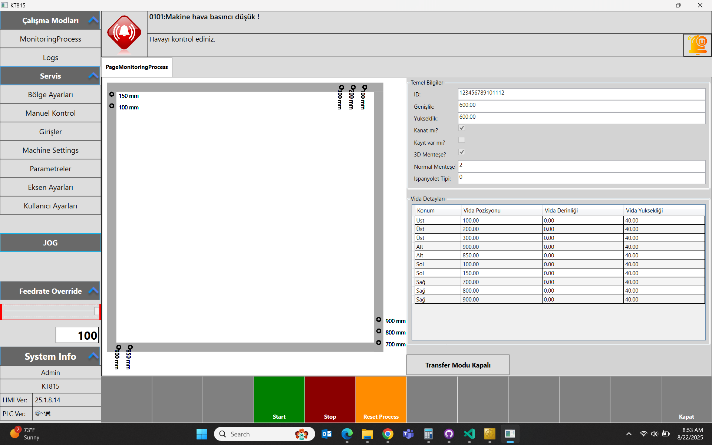

**Monitoring Process Page:** The page where the data read from the JSON file are listed and the screwdriving operation positions on the frame are visually simulated.

## Log Page

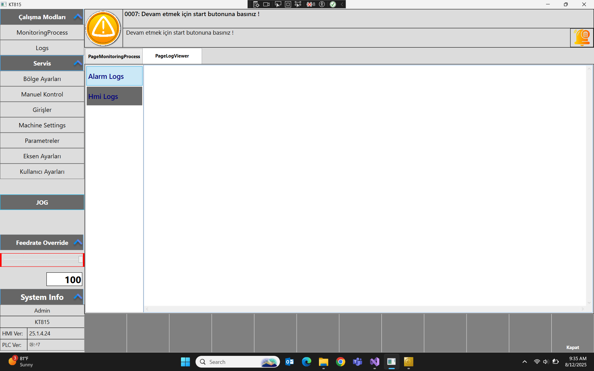

**Log Page:** The page that contains alarm records and HMI logs.

**Alarm Logs:** Contains historical fault records.

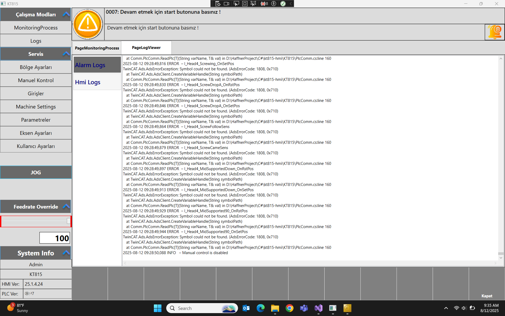

**HMI Logs:** Contains historical records related to HMI faults.

## Jog Page

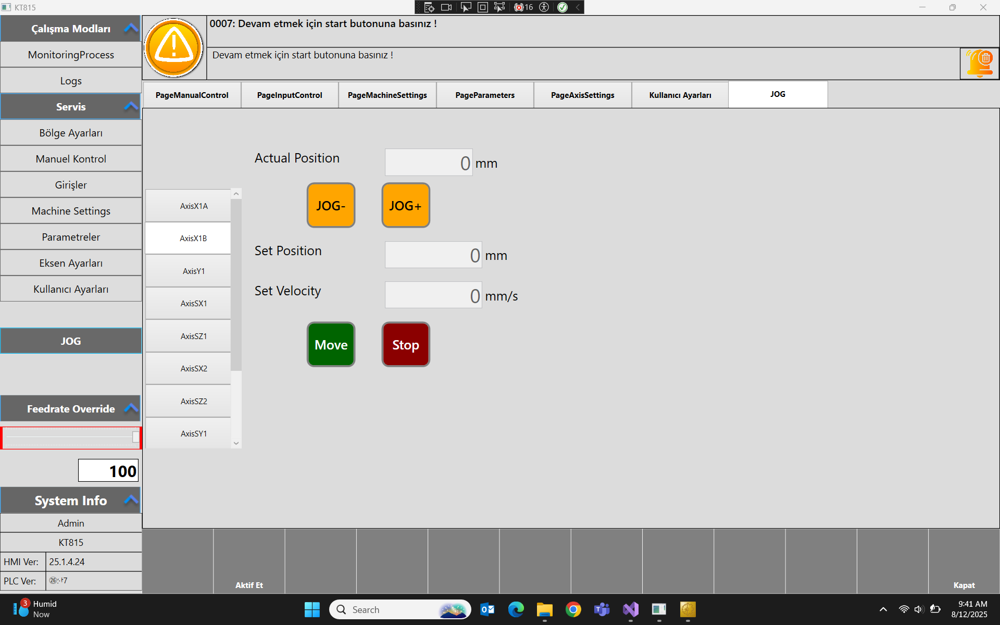

**Jog:** After pressing the Activate button at the bottom of the page, press the relevant axis button, then use the JOG- and JOG+ buttons to move to the desired position, or enter Set Position and Set Velocity values and press Move to move. Press Stop to halt.

## Region Settings Page
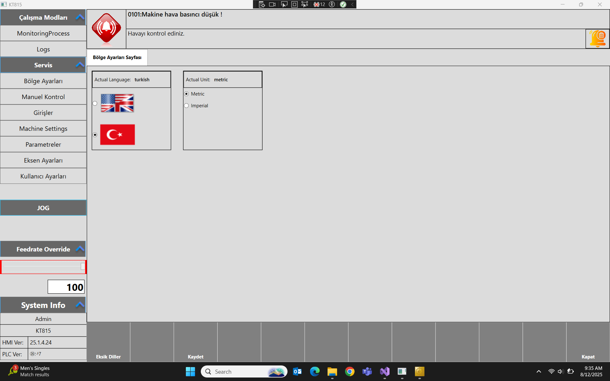

- After selecting the desired language or unit, press **Save**. The changes will be applied.

## Manual Control Page

- Manual Control General Page

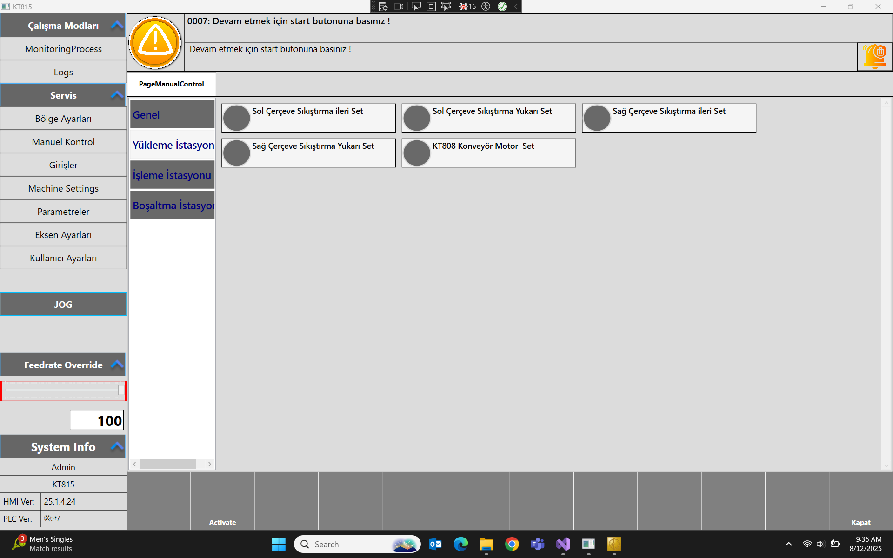

- Manual Control Load Station Page

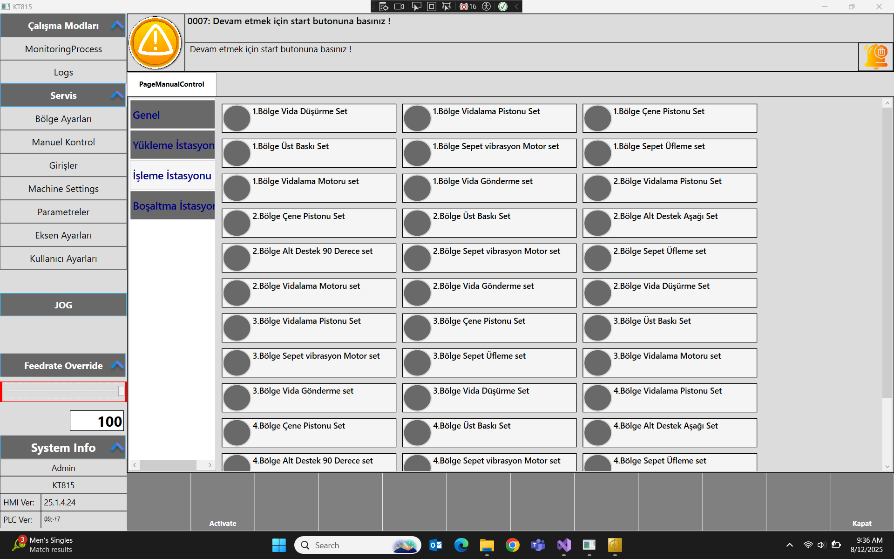

- Manual Control Screwing Station Page

- Press the **Activate** button at the bottom of the page. Select the relevant station, then tap the output you want to actuate to turn it on. Tap again to return it to its previous state.

## Input Page
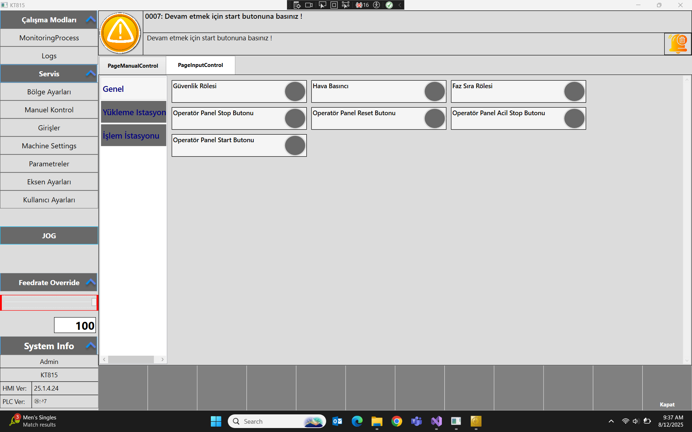

- Inputs General Page

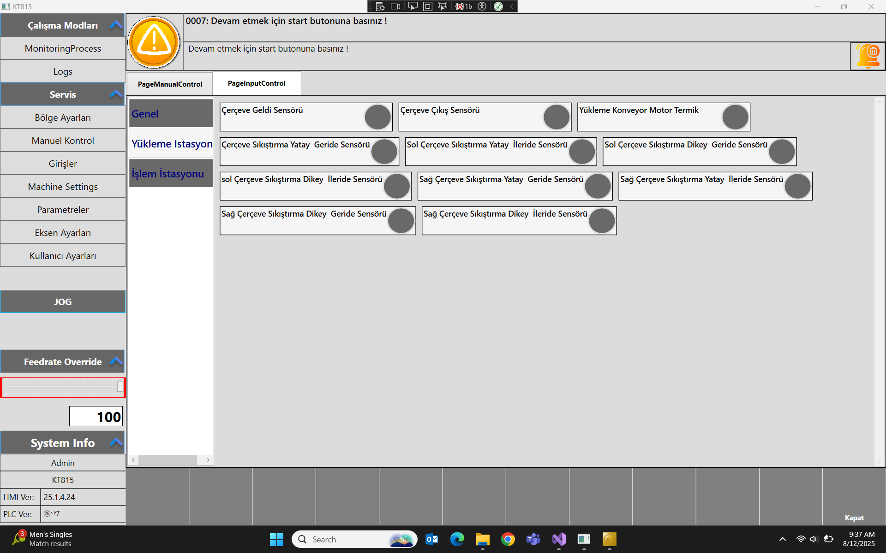

- Inputs Load Station Page

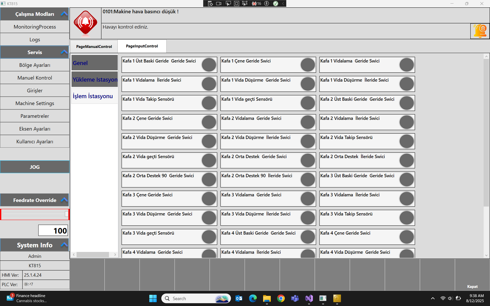

- Inputs Screwing Station Page

- This is the page that shows the machine’s buttons, sensors, and switches.

## Parameters Page
- The page that contains the parameters of all machine stations.

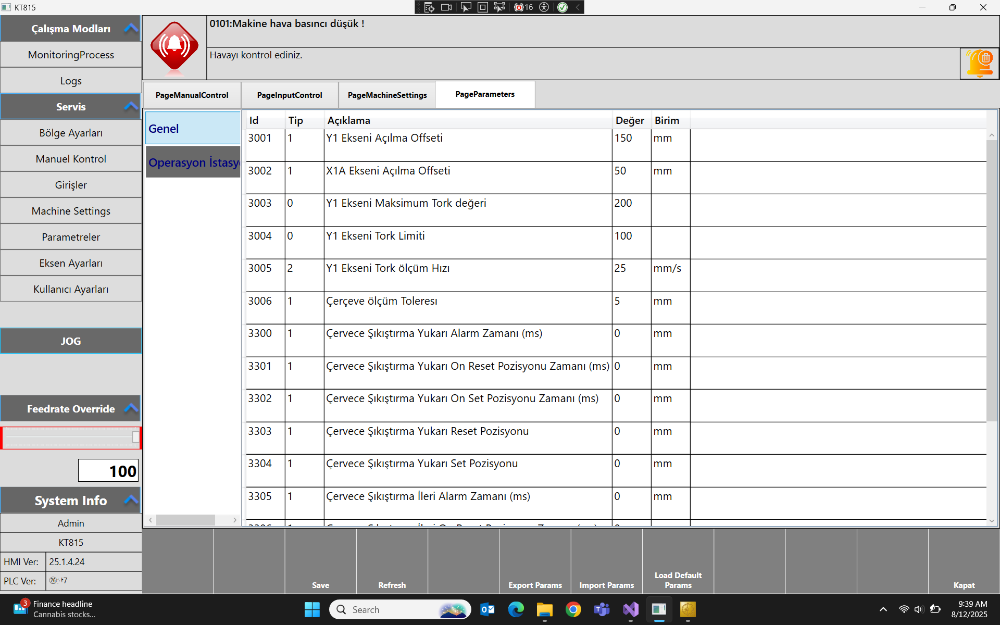

## General Parameters

- **Y1 Axis Opening Offset:** Axis opening offset required for frame loading and unloading operations.
- **X1A Axis Opening Offset:** Axis opening offset required for frame loading and unloading operations.
- **Y1 Axis Maximum Torque:** Maximum torque value for the Y1 axis.
- **Y1 Axis Torque Limit:** Y1 axis frame length measurement torque limit.
- **Y1 Axis Torque Measurement Speed:** Y1 axis frame length measurement speed.
- **Frame Measurement Tolerance:** Specifies the acceptable range for the measured frame length.

### Parameters Page Buttons
- After changing the value(s) of any parameter(s), save with the **Save** button. You can refresh the page with **Refresh**.
- **Export Params**: Export the machine’s current parameters as a CSV file.
- **Import Params**: Import parameters for use on the machine.
- **Load Default Params**: Restore factory settings.

## Axis Settings

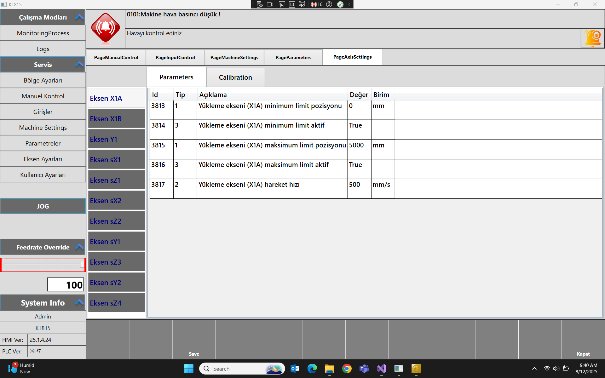

### Axis X1A Parameters

- **Loading Axis (X1A) minimum limit position**: The minimum position the X1A loading axis can move to.
- **Loading Axis (X1A) minimum limit enabled**: Enables the minimum position limit for the X1A loading axis.
- **Loading Axis (X1A) maximum limit position**: The maximum position the X1A loading axis can move to.
- **Loading Axis (X1A) maximum limit enabled**: Enables the maximum position limit for the X1A loading axis.
- **Loading Axis (X1A) moving velocity**: Minimum speed value for the X1A loading axis.

### Axis X1B Parameters
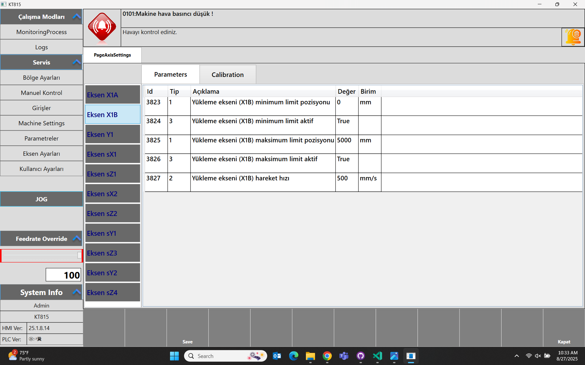

- **Loading Axis (X1B) minimum limit position**: The minimum position the X1B loading axis can move to.
- **Loading Axis (X1B) minimum limit enabled**: Enables the minimum position limit for the X1B loading axis.
- **Loading Axis (X1B) maximum limit position**: The maximum position the X1B loading axis can move to.
- **Loading Axis (X1B) maximum limit enabled**: Enables the maximum position limit for the X1B loading axis.
- **Loading Axis (X1B) moving velocity**: Minimum speed value for the X1B loading axis.

### Axis Y1 Parameters
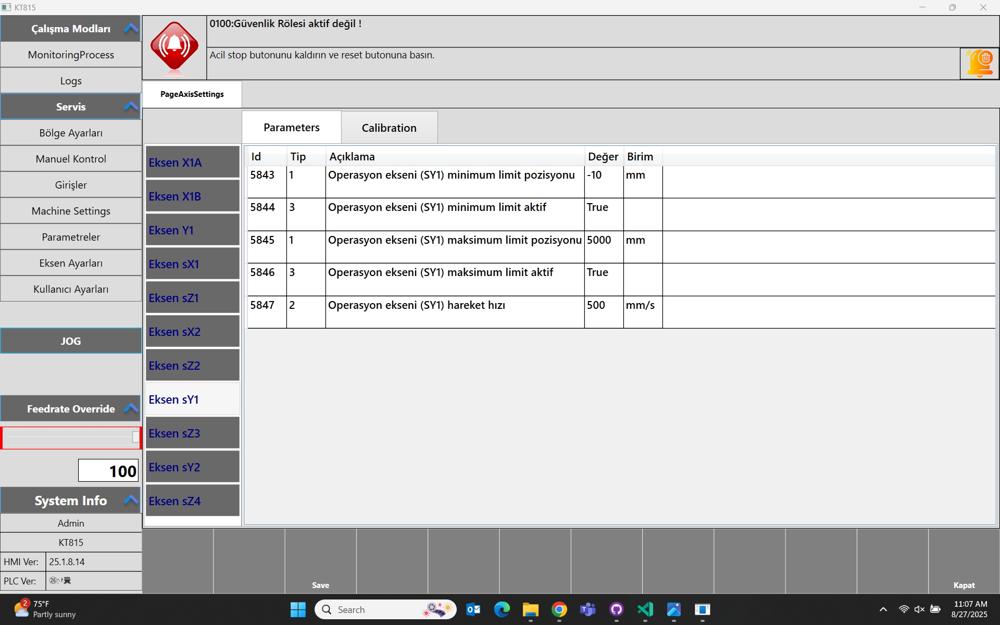

- **Loading Axis (Y1) minimum limit position**: The minimum position the Y1 loading axis can move to.
- **Loading Axis (Y1) minimum limit enabled**: Enables the minimum position limit for the Y1 loading axis.
- **Loading Axis (Y1) maximum limit position**: The maximum position the Y1 loading axis can move to.
- **Loading Axis (Y1) maximum limit enabled**: Enables the maximum position limit for the Y1 loading axis.
- **Loading Axis (Y1) moving velocity**: Minimum speed value for the Y1 loading axis.

### Axis SX1 Parameters
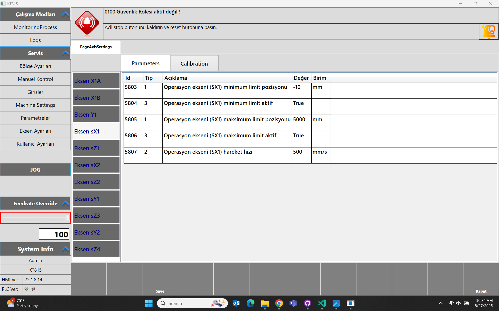

- **Screwing Axis (SX1) minimum limit position**: The minimum position the SX1 screwing axis can move to.
- **Screwing Axis (SX1) minimum limit enabled**: Enables the minimum position limit for the SX1 screwing axis.
- **Screwing Axis (SX1) maximum limit position**: The maximum position the SX1 screwing axis can move to.
- **Screwing Axis (SX1) maximum limit enabled**: Enables the maximum position limit for the SX1 screwing axis.
- **Screwing Axis (SX1) moving velocity**: Minimum speed value for the SX1 screwing axis.

### Axis SZ1 Parameters
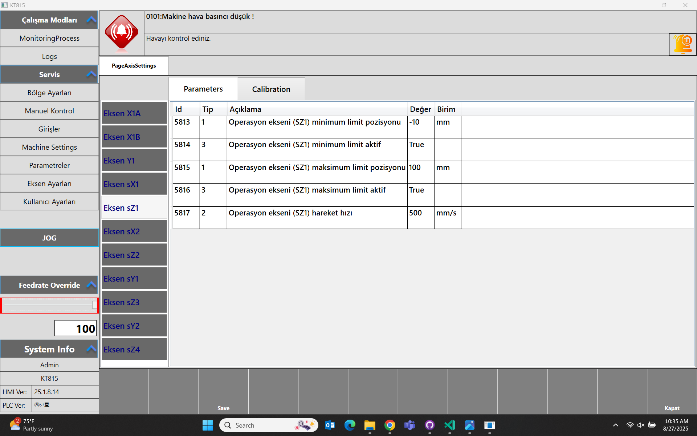

- **Screwing Axis (SZ1) minimum limit position**: The minimum position the SZ1 screwing axis can move to.
- **Screwing Axis (SZ1) minimum limit enabled**: Enables the minimum position limit for the SZ1 screwing axis.
- **Screwing Axis (SZ1) maximum limit position**: The maximum position the SZ1 screwing axis can move to.
- **Screwing Axis (SZ1) maximum limit enabled**: Enables the maximum position limit for the SZ1 screwing axis.
- **Screwing Axis (SZ1) moving velocity**: Minimum speed value for the SZ1 screwing axis.

### Axis SX2 Parameters
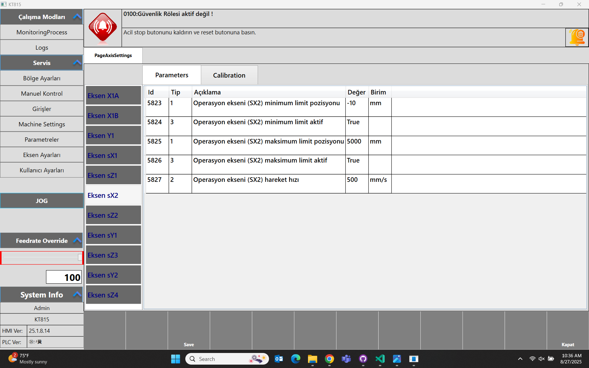

- **Screwing Axis (SX2) minimum limit position**: The minimum position the SX2 screwing axis can move to.
- **Screwing Axis (SX2) minimum limit enabled**: Enables the minimum position limit for the SX2 screwing axis.
- **Screwing Axis (SX2) maximum limit position**: The maximum position the SX2 screwing axis can move to.
- **Screwing Axis (SX2) maximum limit enabled**: Enables the maximum position limit for the SX2 screwing axis.
- **Screwing Axis (SX2) moving velocity**: Minimum speed value for the SX2 screwing axis.

### Axis SZ2 Parameters
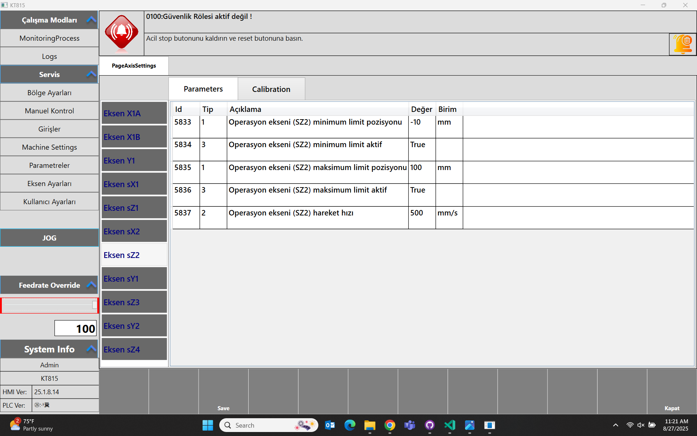

- **Screwing Axis (SZ2) minimum limit position**: The minimum position the SZ2 screwing axis can move to.
- **Screwing Axis (SZ2) minimum limit enabled**: Enables the minimum position limit for the SZ2 screwing axis.
- **Screwing Axis (SZ2) maximum limit position**: The maximum position the SZ2 screwing axis can move to.
- **Screwing Axis (SZ2) maximum limit enabled**: Enables the maximum position limit for the SZ2 screwing axis.
- **Screwing Axis (SZ2) moving velocity**: Minimum speed value for the SZ2 screwing axis.

### Axis SY1 Parameters

- **Screwing Axis (SY1) minimum limit position**: The minimum position the SY1 screwing axis can move to.
- **Screwing Axis (SY1) minimum limit enabled**: Enables the minimum position limit for the SY1 screwing axis.
- **Screwing Axis (SY1) maximum limit position**: The maximum position the SY1 screwing axis can move to.
- **Screwing Axis (SY1) maximum limit enabled**: Enables the maximum position limit for the SY1 screwing axis.
- **Screwing Axis (SY1) moving velocity**: Minimum speed value for the SY1 screwing axis.

### Axis SZ3 Parameters
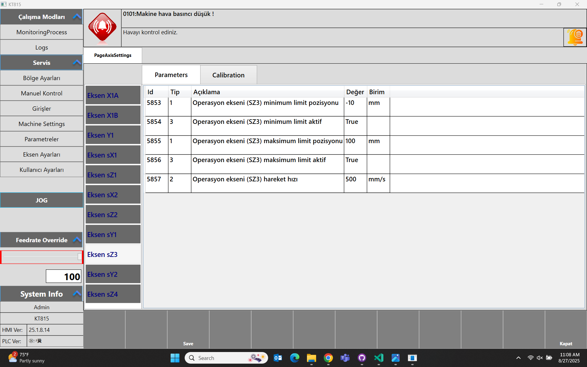

- **Screwing Axis (SZ3) minimum limit position**: The minimum position the SZ3 screwing axis can move to.
- **Screwing Axis (SZ3) minimum limit enabled**: Enables the minimum position limit for the SZ3 screwing axis.
- **Screwing Axis (SZ3) maximum limit position**: The maximum position the SZ3 screwing axis can move to.
- **Screwing Axis (SZ3) maximum limit enabled**: Enables the maximum position limit for the SZ3 screwing axis.
- **Screwing Axis (SZ3) moving velocity**: Minimum speed value for the SZ3 screwing axis.

### Axis SY2 Parameters
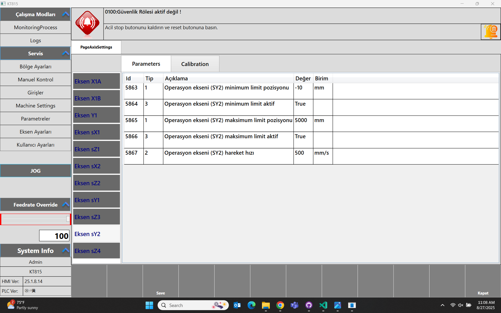

- **Screwing Axis (SY2) minimum limit position**: The minimum position the SY2 screwing axis can move to.
- **Screwing Axis (SY2) minimum limit enabled**: Enables the minimum position limit for the SY2 screwing axis.
- **Screwing Axis (SY2) maximum limit position**: The maximum position the SY2 screwing axis can move to.
- **Screwing Axis (SY2) maximum limit enabled**: Enables the maximum position limit for the SY2 screwing axis.
- **Screwing Axis (SY2) moving velocity**: Minimum speed value for the SY2 screwing axis.

### Axis Z4 Parameters
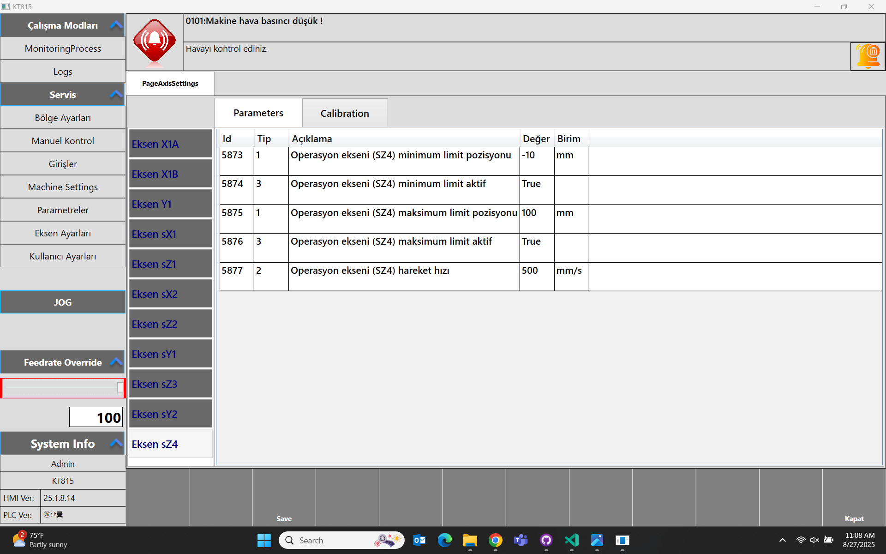

- **Screwing Axis (SZ4) minimum limit position**: The minimum position the SZ4 screwing axis can move to.
- **Screwing Axis (SZ4) minimum limit enabled**: Enables the minimum position limit for the SZ4 screwing axis.
- **Screwing Axis (SZ4) maximum limit position**: The maximum position the SZ4 screwing axis can move to.
- **Screwing Axis (SZ4) maximum limit enabled**: Enables the maximum position limit for the SZ4 screwing axis.
- **Screwing Axis (SZ4) moving velocity**: Minimum speed value for the SZ4 screwing axis.

### Axis Calibration
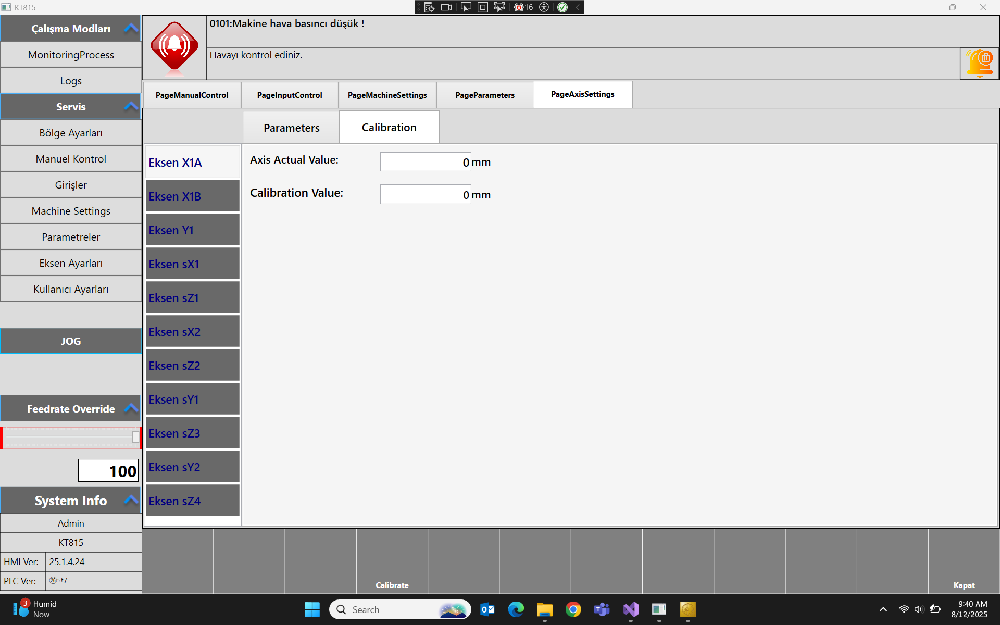

- After selecting the relevant axis on the page, enter the value you want to calibrate the axis to in **Calibration Value**. When you press the **Calibrate** button at the bottom of the page, the axis will be calibrated to the desired value, and the calibrated value will appear under **Axis Actual Value**.

## User Settings

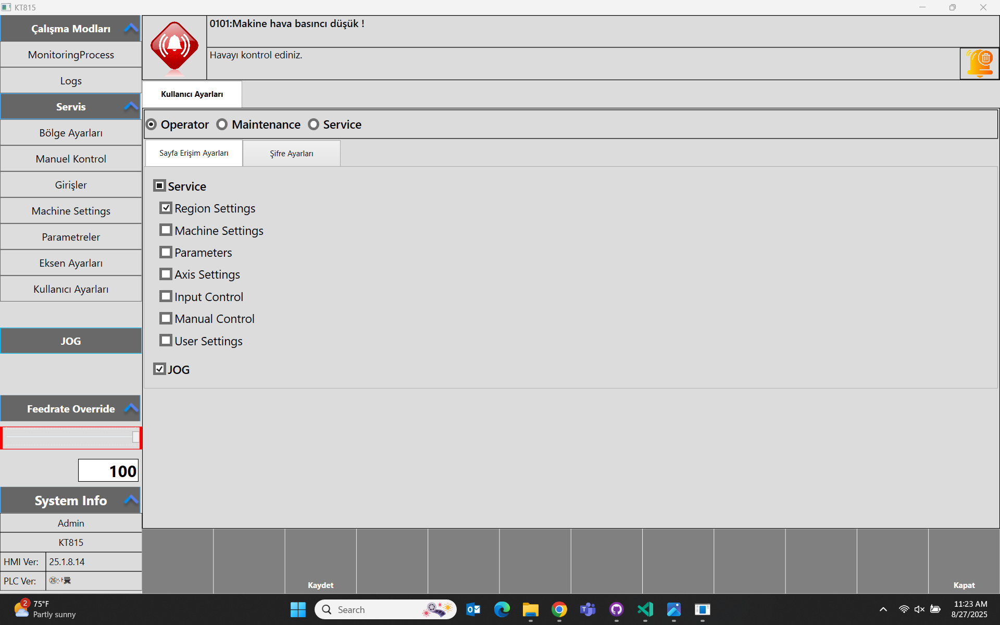

### Page Access Settings
- On this page, you can select the pages that can be accessed in **Operator**, **Maintenance**, and **Service** modes. After selecting the mode, choose the page or pages you want to allow in that mode. Then press **Save** to apply the changes.

### Password Settings
- On this page, you can set passwords for **Operator**, **Maintenance**, and **Service** modes. After selecting the mode, enter your chosen password and press **Save** to change the password.